# MIU Talent Connect

## 1. Problem Statement

Students and recent graduates often struggle to secure roles matching their skills, while employers face challenges finding qualified candidates efficiently. Traditional hiring methods are time-consuming and often overlook emerging talent without strong connections.

**MIU Talent Connect bridges this gap by providing:**

- **For Students:** A platform where they can easily create, update, and share their professional profiles with potential employers, enabling them to gain visibility in a competitive job market.

- **For Employers:** A robust search and filtering system that allows them to efficiently locate candidates who match their specific job criteria, saving time and resources in the hiring process.

- **For Universities:** An optional feature that allows educational institutions to verify and endorse student profiles, adding credibility to candidate information and supporting students’ job-seeking efforts.
  By bridging the gap between students and employers, this website aims to streamline the recruitment process, increase employment opportunities for students, and provide employers with a diverse pool of qualified candidates.

This centralized platform streamlines recruitment, broadens access to qualified candidates, and increases opportunities for students, creating a win-win for all stakeholders.

## 2. Requirement Analysis

[View Requirement Analysis](REQUIREMENT_ANALYSIS.md)

## 3. Software Modeling

- **3.1 Class Diagram**

  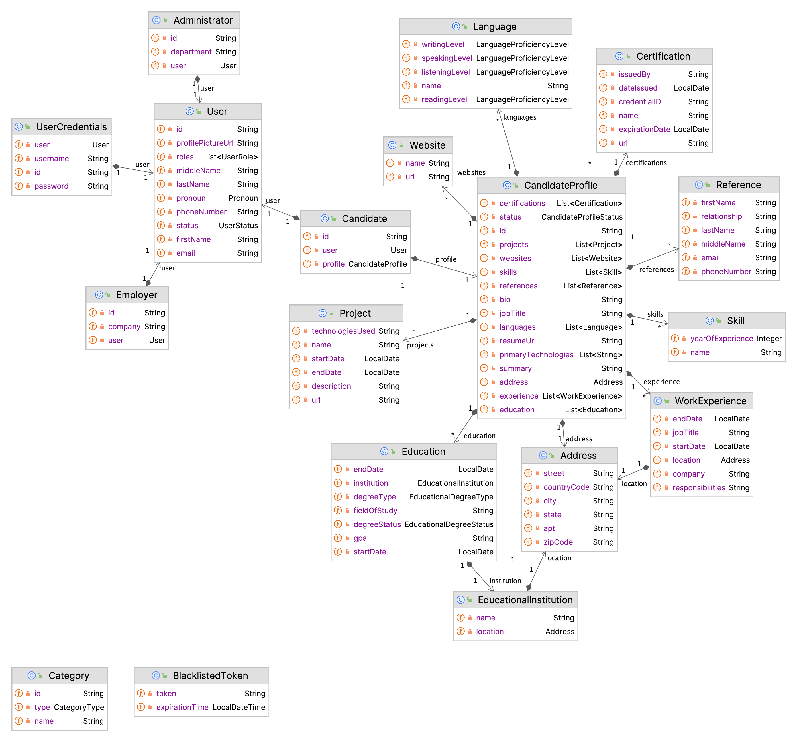

- **3.2 Entity Diagram**

  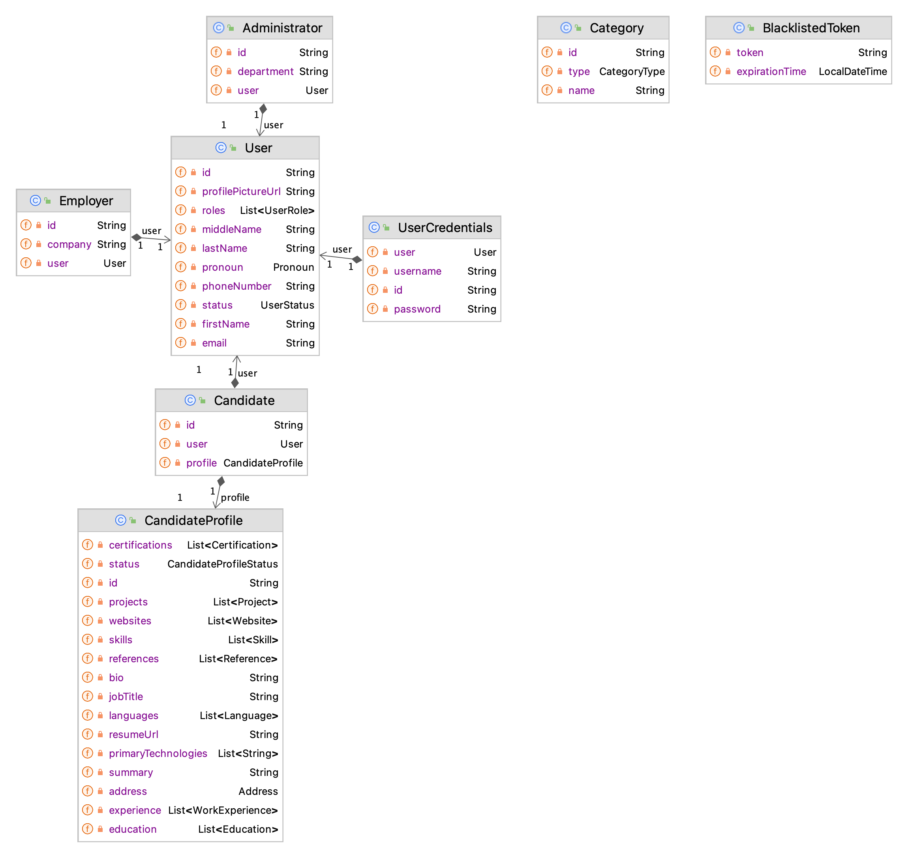

## 4. Architecture

- **System Architecture**

  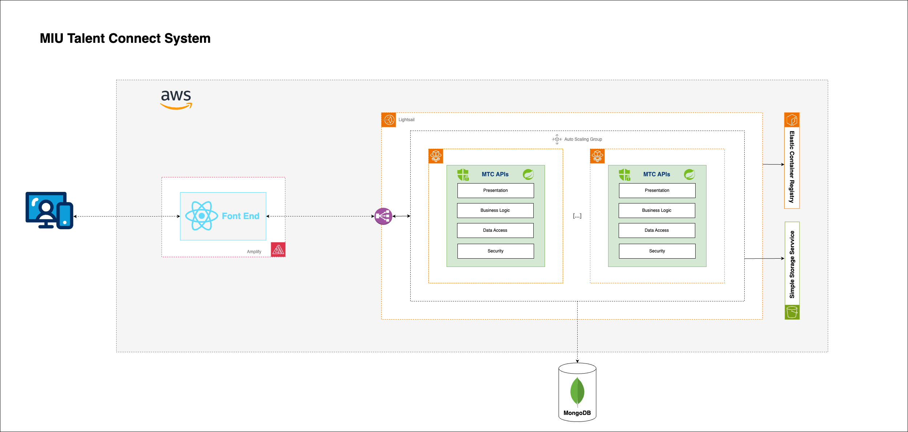

## 5. Application Showcases

Below are screenshots of some main features of the application

Home Page
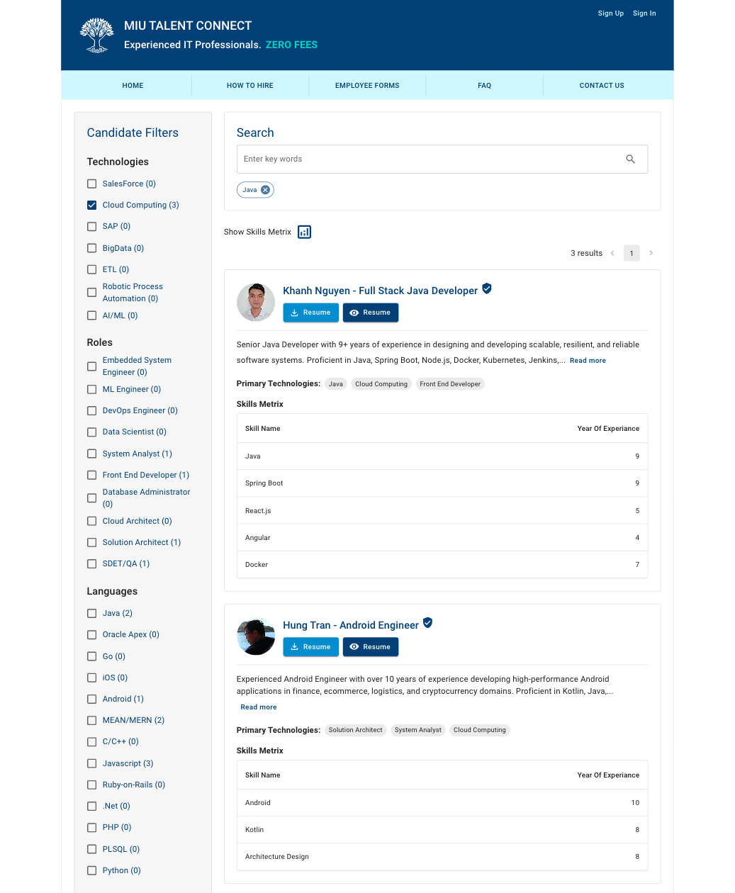

Candidate Profile Page
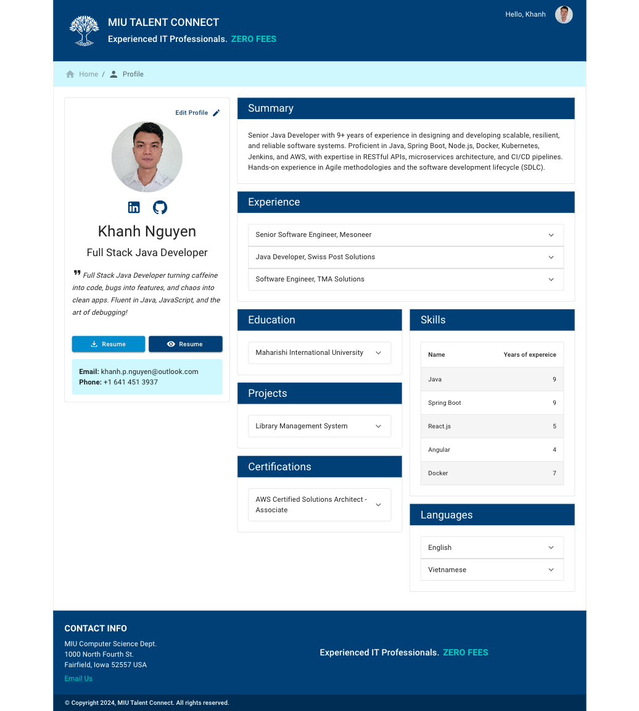

Candidate Profile Wizard
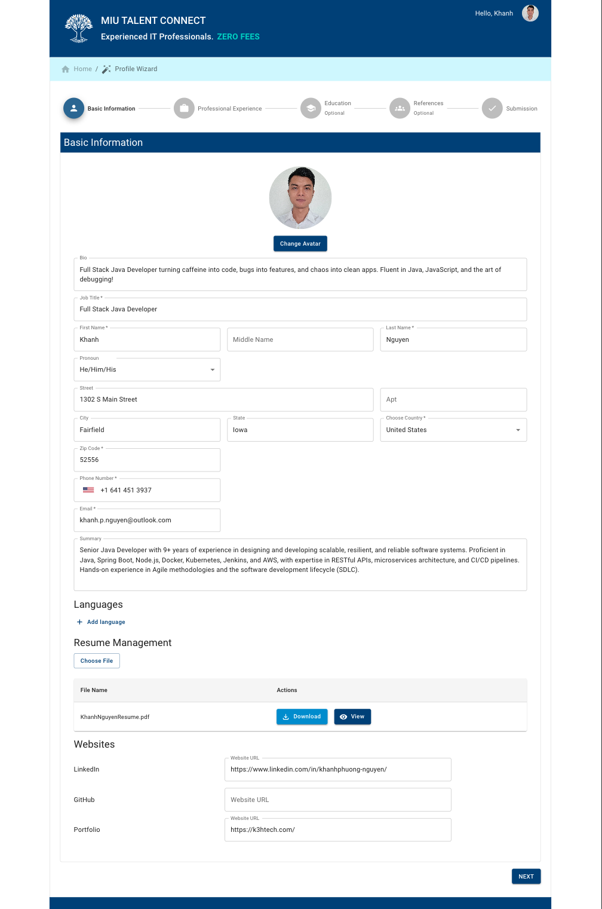

Candidate Profile Wizard - Optional Step
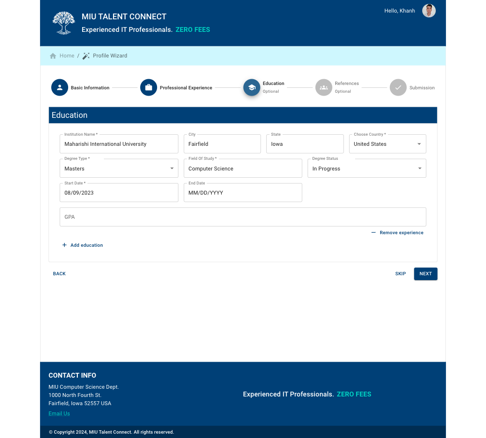

System Admin Profile Menu
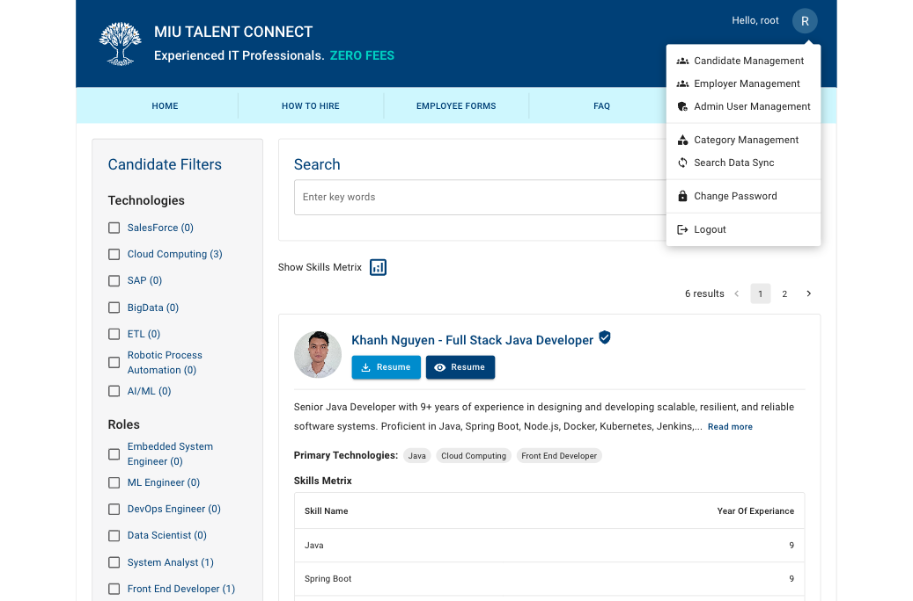

Candidate Management Page
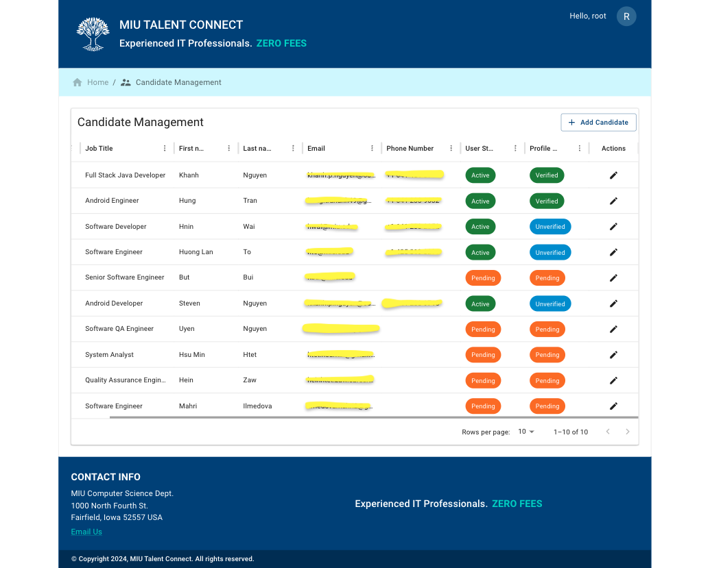

Candidate Management Edit Mode Page
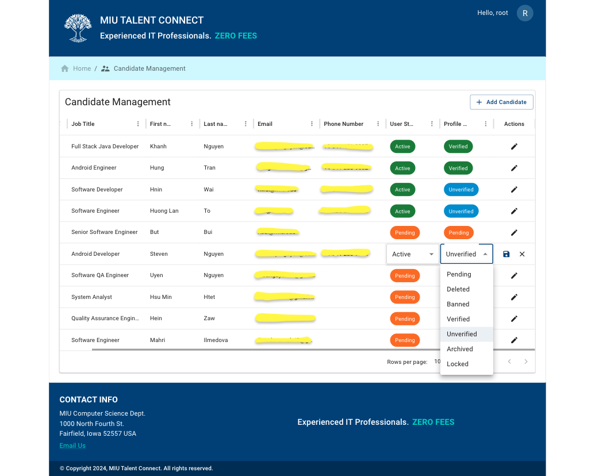

Category Management Page
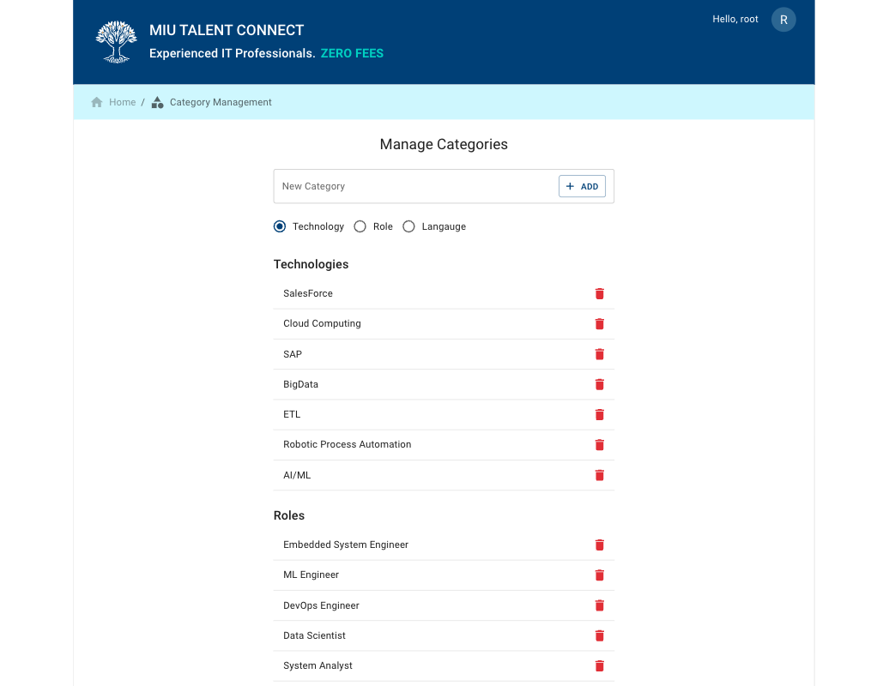

HAL Explorer
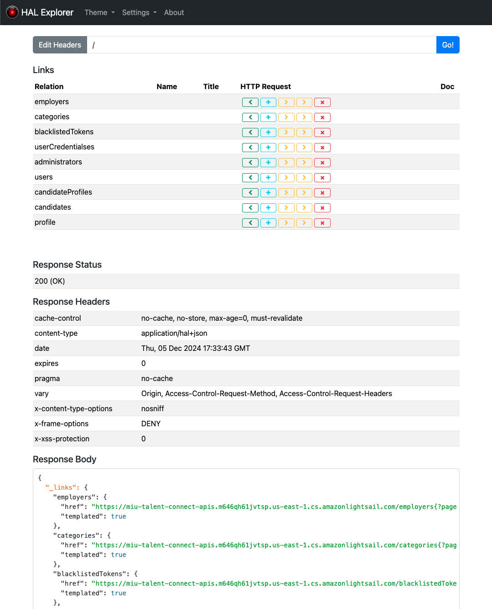

## 6. Software Setup Instructions

- **1. Front-End:**

  - **1.1 Environment Variables**

    | Name                | Description                                                                                                                                                                                                                                                                              | Sample Value                     |
    | ------------------- | ---------------------------------------------------------------------------------------------------------------------------------------------------------------------------------------------------------------------------------------------------------------------------------------- | -------------------------------- |
    | `VITE_API_BASE_URL` | API Base URL, you can either `export VITE_API_BASE_URL=https://api.miutalentconnect.org` before `npm run build` or set direct value in file `.env.production` (located in `frontend` directory, values in `.env` or `.env.development` are applied for running app using `npm run dev`). | https://api.miutalentconnect.org |

  - **1.2 Project Run and Build**

    - To run app in development mode run `npm run dev`.
    - To build project, navigate to `frontend` directory and run `npm run build`.
    - Run `npm run preview` to run the app as production alike after `npm run build`.

  - **1.3 Deployment**
    - Go to [Amazon Amplify](https://console.aws.amazon.com/amplify/create/add-repo) and follow step-by-step instruction. Below is a screenshot of a successful deployed application on AWS Amplify.
      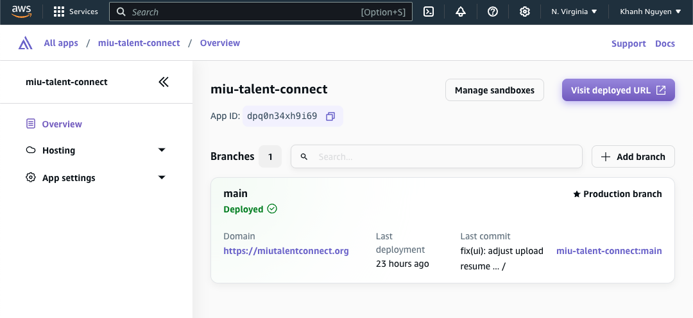

- **2. Back-End:**

  - **2.1 Environment Variables**

    | Name                                        | Description                                                                                                                                                                                                                                                                                                                                          | Sample Value                                                             |
    | ------------------------------------------- | ---------------------------------------------------------------------------------------------------------------------------------------------------------------------------------------------------------------------------------------------------------------------------------------------------------------------------------------------------- | ------------------------------------------------------------------------ |
    | `SPRING_PROFILES_ACTIVE`                    | Spring profiles to be activated                                                                                                                                                                                                                                                                                                                      | prod                                                                     |
    | `APP_URL`                                   | Application access URL which is used for generating access URLs that are sending out to users through emails.                                                                                                                                                                                                                                        | https://miutalentconnect.org                                             |
    | `SERVER_PORT`                               | Rest APIs port.                                                                                                                                                                                                                                                                                                                                      | 80                                                                       |
    | `SPRING_DATA_MONGODB_URI`                   | MongoDB connection URI.                                                                                                                                                                                                                                                                                                                              | mongodb+srv://${USERNAME}:${PASSWORD}@${CLUSTER}.mongodb.net/${DATABASE} |
    | `AWS_REGION`                                | AWS Region where your S3 bucket is located.                                                                                                                                                                                                                                                                                                          | us-east-1                                                                |
    | `AWS_S3_BUCKET`                             | AWS S3 bucket name                                                                                                                                                                                                                                                                                                                                   | miu-talent-connect                                                       |
    | `AWS_ACCESS_KEY_ID`                         | AWS Access Key ID                                                                                                                                                                                                                                                                                                                                    | Your AWS Access Key ID.                                                  |
    | `AWS_SECRET_KEY`                            | AWS Secret Key                                                                                                                                                                                                                                                                                                                                       | Your AWS Secret Key.                                                     |
    | `JWT_SECRET_KEY`                            | JWT Secret Key.                                                                                                                                                                                                                                                                                                                                      | hLaL6TKOHvyAIH9MY5Kx1EyUQtF6KES0M+c8xO+brZs=                             |
    | `APP_CORS_ALLOWED_ORIGINS`                  | Cors allowed origins                                                                                                                                                                                                                                                                                                                                 | miutalentconnect.org                                                     |
    | `APP_CANDIDATE_SEARCHABLE_PROFILE_STATUSES` | Profile statuses that are available for searching                                                                                                                                                                                                                                                                                                    | VERIFIED,UNVERIFIED                                                      |
    | `DEFAULT_SYSTEM_ADMIN_USERNAME`             | Default System admin username                                                                                                                                                                                                                                                                                                                        | sysadmin                                                                 |
    | `DEFAULT_SYSTEM_ADMIN_PASSWORD`             | Default System Admin user's password                                                                                                                                                                                                                                                                                                                 |                                                                          |
    | `APP_SEARCH_DATA_SYNCHRONIZATION_CRON`      | Search data synchronization scheduling in Cron format. Search data are located in multiple collections, to make it more efficient, there is a process that aggregates search data from different collections into a single collection which is indexed for `Full Text Search` ability. This process is scheduled to run within this Cron expression. | 0 _/5 _ \* \* \*                                                         |
    | `EMAIL_HOST`                                | Email server host.                                                                                                                                                                                                                                                                                                                                   | smtp.gmail.com                                                           |
    | `EMAIL_PORT`                                | Email server port.                                                                                                                                                                                                                                                                                                                                   | 587                                                                      |
    | `EMAIL_PROTOCOL`                            | Email protocol.                                                                                                                                                                                                                                                                                                                                      | smtp                                                                     |
    | `EMAIL_USERNAME`                            | Email account's username.                                                                                                                                                                                                                                                                                                                            | yourusername@example.com                                                 |
    | `EMAIL_PASSWORD`                            | Email account's password                                                                                                                                                                                                                                                                                                                             | Your email account's password                                            |

  - **2.2 Project Run and Build**

    - To run project, you can open `backend` project and run it from an IDE, or navigate to `backend` directory and run command `mvn spring-boot:run`.
    - To build project `mvn clean package`.

  - **2.3 Deployment**
    - Build project and create a docker image with a provided Dockerfile in project directory.
    - Push docker image to a repository registry (Docker Hub or [Lightsail Container Service Images](https://docs.aws.amazon.com/en_us/lightsail/latest/userguide/amazon-lightsail-pushing-container-images.html)).
    - Follow [Create and manage container service deployments in Lightsail](https://docs.aws.amazon.com/lightsail/latest/userguide/amazon-lightsail-container-services-deployments.html) to create a new container service.
    - Provide all `environment variables` mentioned in `Environment Variables` section and start creating new deployment. Below is a screenshot of a successful deployed application on AWS Lightsail.
      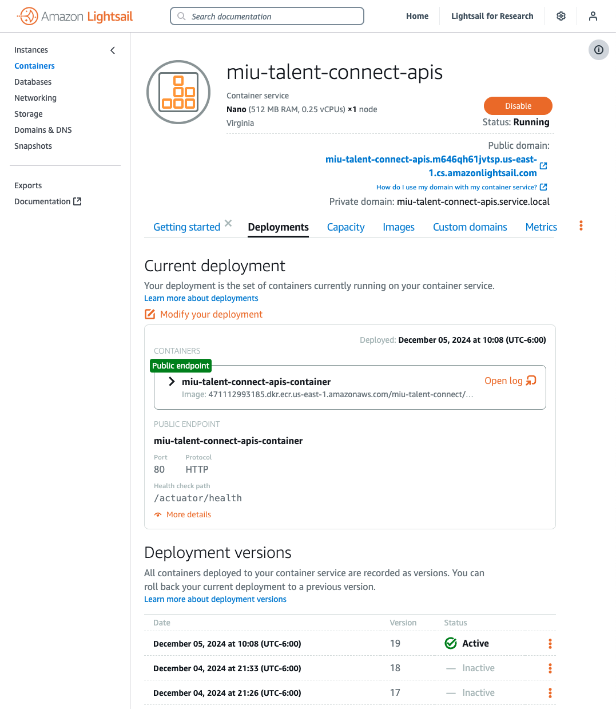

## 7. CI/CD Setup

- **1. Front-End**

  AWS Amplify supports auto build and deploy by integrating with your GitHub repository.
  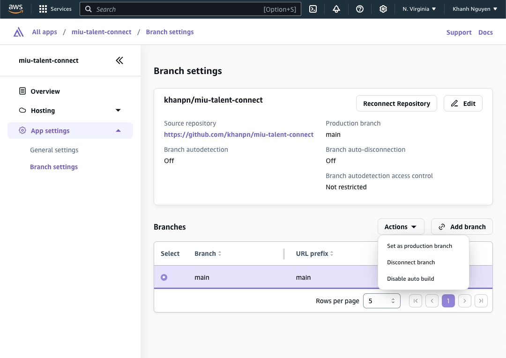

- **2. Back-End**

  - Create a new Git Actions workflow using a defined `.github/workflows/aws-lightsail.yml` as a reference for automating build and deploy `backend` project to Lightsail Container Service.
  - Refer to `backend/.aws/lightsail-service-config-template.json` for creating input argument for `--cli-input-json` of `aws lightsail create-container-service-deployment` command.
    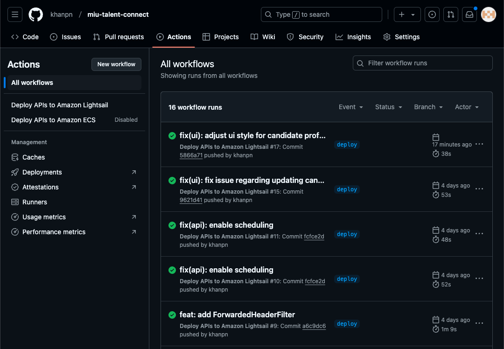
